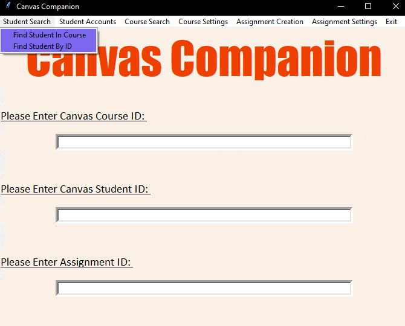

# Canvas_App
  

# Goal:
The goal of this project is to help Stevens ECE department with adding and removing mutiple users from classes on Canvas. Due to the nature of how the API keys worked, the team could not add/delete users from canvas as it would be security threat. The team spun this idea to instead make an application for both students/teachers to use canvas for unique functions such as creating assignments, looking at class rosters, looking at grades, etc. The funcationality for add/delete is in place, but api will tell the use they do not have permission to use these function present.    

# Library to install: 
pip3 install canvasapi 
pip3 install tkinter
pip3 install DateTime

# How to get API Key: 
On the canvas website, click on the account icon and go to account settings. On this page, scroll down and find the button under "Approved Integrations" labelled "New Access Token" and click on it. You will be asked for your purpose and to create an expiration date. You can leave the expiration date blank if you wish for the token to never expire. After providing the information, the token will be generated and presented to you. Make sure to copy the token and save it somewhere safe! You will not be able to retrieve the full token once you leave the page so make sure you record it somewhere you can find it. Once you have the token, open up canvas_app.py and paste the token where it says 'API_KEY' within the double quotation marks after the equals sign. Once this is in place, you will be able to run the program!

# API URL: 
This will be the link used for when user is in canvas, so at stevens it would be something like: https://sit.instructure.com/ and other colleges/schools would have it as something else. 

# How the Program Works:
Upon running the python file, you should be greeted with the Canvas Companion main window. In this window, there will be 3 text boxes: one for a student's canvas ID, one for a canvas course's ID, and one for a canvas assignment's ID. To use the application's 24 functions, you will need to enter the information these functions need within these text boxes. The functions can be accessed from the menu bar, so once you enter the information you can click on the function you would like to use to run it. Please reference the guide below to see which functions require which inputs

# Function Cheat Sheet
Notice: Student ID is not the standard 8 digits used by Stevens rather its unique to Canvas API (it usually 5 digits) 

1. Course ID 
    a. "Get Course Name"
    b. "List of All Users Within a Course"
    c. "Find Personnel Within a Course"
    d. "List All Students Within a Course"
    e. "Find All Active Students Within a Course"
    f. "Update Course Name"
    g. "Change Course Start/End Time (Date/Time)"
    h. "Change Course Start/End Time (ISO Format)" 
    i. "End Course"
    j. "Delete Course"
    k. "Create Advanced Assignments"
    l. "Create Basic Assignments" 
    m. "List All Assignments"
    n. "List Ungraded Assignments"
    
2. Student ID (SIS ID)
    a. "Delete Student"
    b. "Find Student by ID"

3. Assignment ID
    a. "Get Student Scores on an Assignment"

4. Multiple Entries
    a. "Find Student in Course" -> Requires Course ID and Student ID (SIS ID)
    b. "Add Users to a Course"  -> Requires Course ID and Student ID (SIS ID)
    c. "List of Students' Grades" -> Requires Course ID and Assignment ID 
    d. "List of a Student's Classes" -> Requires Course ID and Student ID (SIS ID) 
    e. "Delete Assignment" -> Requires Course ID and Assignment ID 
    f. "Update Assignment Elements" -> Requires Course ID and Assignment ID 
    g. "Get Assignment Name" -> Requires Course ID and Assignment ID

